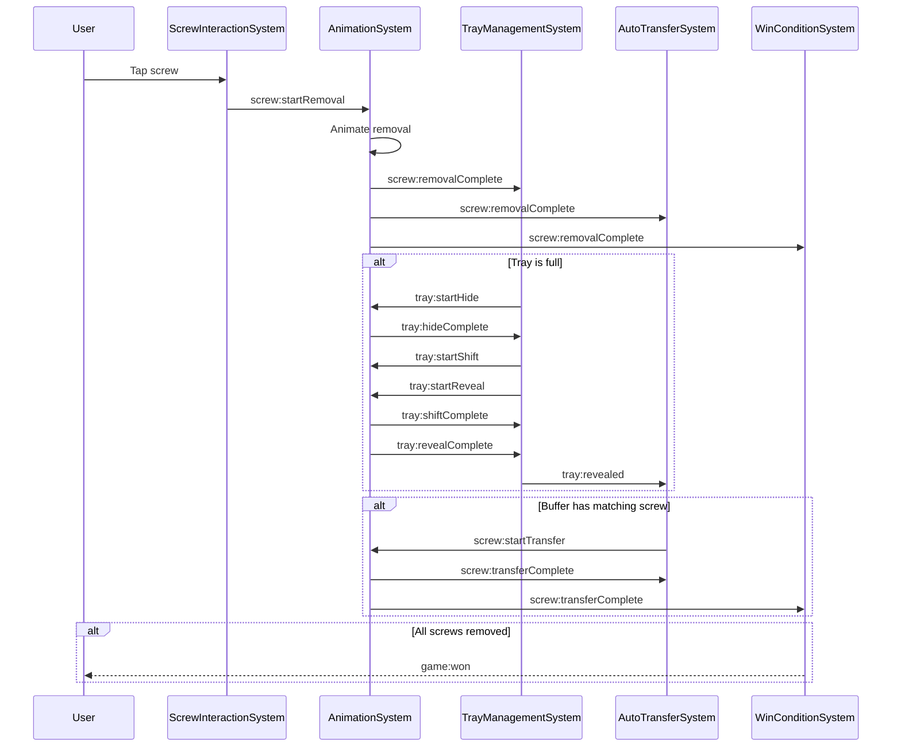
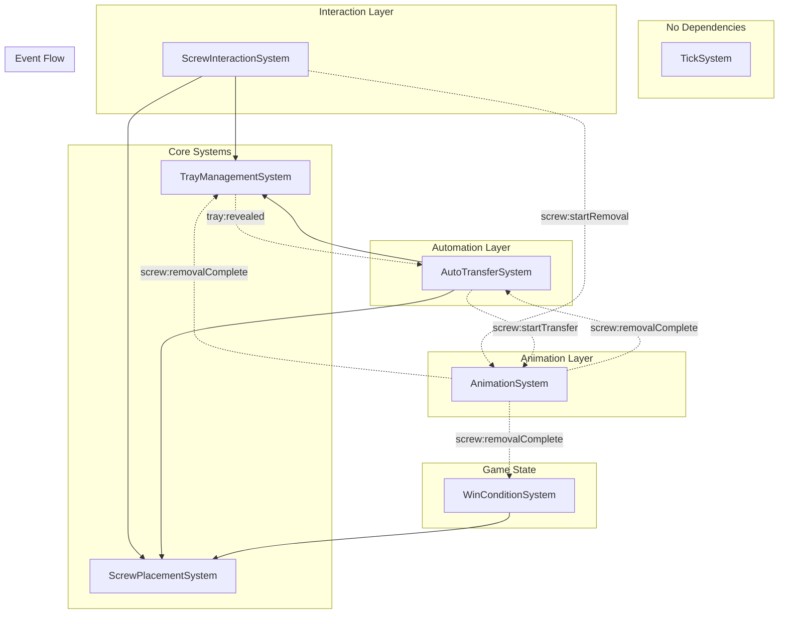

# Game Architecture for AI Agents

This document provides a comprehensive technical overview of Screw Master's architecture, designed to help AI agents understand the codebase and implement new features effectively.

---

## Executive Summary

Screw Master is built on a **three-layer architecture**:

1. **Astro Application Framework** - Top-level lifecycle, plugins, screen management
2. **ODIE ECS** - Entity-Component-System for game logic within scenes
3. **PixiJS v8** - 2D rendering engine

**Key Design Decisions:**

| Decision | Rationale |
|----------|-----------|
| Event-driven communication | Systems are decoupled; communicate via `GameEventBus` |
| Modular animator pattern | Animations isolated in specialized classes |
| Component-only state | All game state lives in Components, not Systems |
| WeakMap visual registries | GC-friendly sprite references without manual cleanup |
| Deterministic frame counter | Enables reproducible bug reports and E2E testing |

---

## System Architecture

### Layer Hierarchy

```
┌─────────────────────────────────────────────────────────────────┐
│                      ASTRO APPLICATION                          │
│  ┌───────────────────────────────────────────────────────────┐ │
│  │ Plugins: Stage, Resize, Resource, Keyboard, Screens       │ │
│  └───────────────────────────────────────────────────────────┘ │
│  ┌───────────────────────────────────────────────────────────┐ │
│  │ Screens: LoadingScreen, GameScreen (extends BaseScreen)   │ │
│  └───────────────────────────────────────────────────────────┘ │
│                              │                                  │
│                              ▼                                  │
│  ┌───────────────────────────────────────────────────────────┐ │
│  │                  ODIE Scene2D (GameScene)                 │ │
│  │  ┌─────────────────────────────────────────────────────┐ │ │
│  │  │ SYSTEMS (game logic, event-driven)                  │ │ │
│  │  │  TickSystem → ScrewPlacementSystem →                │ │ │
│  │  │  AnimationSystem → ScrewInteractionSystem →         │ │ │
│  │  │  AutoTransferSystem → WinConditionSystem →          │ │ │
│  │  │  TrayManagementSystem                               │ │ │
│  │  └─────────────────────────────────────────────────────┘ │ │
│  │  ┌─────────────────────────────────────────────────────┐ │ │
│  │  │ ENTITIES (game objects with Components)             │ │ │
│  │  │  ScrewEntity, TrayEntity, PartEntity,               │ │ │
│  │  │  BufferTrayEntity, GameStateEntity                  │ │ │
│  │  └─────────────────────────────────────────────────────┘ │ │
│  └───────────────────────────────────────────────────────────┘ │
└─────────────────────────────────────────────────────────────────┘
```

### Rendering Layers (Z-Order)

GameScene manages 5 rendering layers (bottom to top):

```
5. animationLayer      ← Animated screws (topmost)
4. uiLayer             ← Tray frames, covers, buttons
3. entityContainer     ← Parts & screws (ODIE View2DSystem)
2. puzzleLayer         ← Puzzle base background
1. backgroundLayer     ← Scene background (bottommost)
```

### File Locations Map

| Category | Path | Description |
|----------|------|-------------|
| **Bootstrap** | `src/app/bootstrap.ts` | Application initialization with plugins |
| **Config** | `src/app/config.ts` | Canvas dimensions, colors |
| **Screens** | `src/ui/screens/` | Astro screens (Base, Game, Loading) |
| **Scene** | `src/scenes/game/GameScene.ts` | Main game scene orchestration |
| **Systems** | `src/scenes/game/systems/` | All ECS systems |
| **Components** | `src/scenes/game/components/` | All ECS components |
| **Entities** | `src/scenes/game/entities/` | Entity type definitions |
| **Factories** | `src/scenes/game/factories/` | Entity creation helpers |
| **Animators** | `src/scenes/game/systems/animation/` | Animator classes |
| **Utilities** | `src/scenes/game/utils/` | Event bus, layout, positions |
| **Types** | `src/scenes/game/types/` | Component access interfaces |
| **Shared Types** | `src/shared/types/` | Position, Size, ScrewColor, etc. |
| **Part Defs** | `src/shared/parts/definitions/` | Part definition files |
| **Level Loader** | `src/shared/levels/loader.ts` | Level loading and validation |
| **Test Harness** | `src/shared/debug/` | E2E testing infrastructure |

---

## ECS Systems

### System Registration Order

Systems are registered in this specific order in `GameScene.registerSystems()`:

```typescript
1. TickSystem              // Must be first - updates frame counter
2. ScrewPlacementSystem    // No dependencies, used by others
3. AnimationSystem         // Listens for animation events
4. ScrewInteractionSystem  // Handles user input
5. AutoTransferSystem      // Auto-moves buffer screws
6. WinConditionSystem      // Checks game state
7. TrayManagementSystem    // Orchestrates tray transitions
```

**Why order matters:**
- `TickSystem` must run first to ensure frame counter is updated
- `ScrewPlacementSystem` must be available before interaction systems query it
- `TrayManagementSystem` should process events before `AutoTransferSystem`

### System Details

#### TickSystem
**File:** `src/scenes/game/systems/TickSystem.ts`

| Property | Value |
|----------|-------|
| Purpose | Increments frame counter for deterministic debugging |
| Dependencies | None |
| Events Listened | None |
| Events Emitted | None |

---

#### ScrewPlacementSystem
**File:** `src/scenes/game/systems/ScrewPlacementSystem.ts`

| Property | Value |
|----------|-------|
| Purpose | Determines valid placement targets for screws |
| Dependencies | TrayManagementSystem (checks `isBusy()`) |
| Events Listened | None |
| Events Emitted | None |

**Key Methods:**
```typescript
findPlacementTarget(color: ScrewColor): PlacementTarget | null
reserveSlot(target: PlacementTarget, entity: Entity): void
hasValidMoves(): boolean
isBufferFull(): boolean
anyTrayAnimating(): boolean
findAvailableColoredTray(color: ScrewColor): Entity | null
```

---

#### ScrewInteractionSystem
**File:** `src/scenes/game/systems/ScrewInteractionSystem.ts`

| Property | Value |
|----------|-------|
| Purpose | Handles user tap input on screws |
| Dependencies | ScrewPlacementSystem |
| Events Listened | None (uses TouchInput) |
| Events Emitted | `screw:startRemoval` |

---

#### AnimationSystem
**File:** `src/scenes/game/systems/AnimationSystem.ts`

| Property | Value |
|----------|-------|
| Purpose | Coordinates all animations via specialized animators |
| Dependencies | None |
| Events Listened | `screw:startRemoval`, `screw:startTransfer`, `tray:startHide`, `tray:startShift`, `tray:startReveal` |
| Events Emitted | `screw:removalComplete`, `screw:transferComplete`, `tray:hideComplete`, `tray:shiftComplete`, `tray:revealComplete` |

---

#### AutoTransferSystem
**File:** `src/scenes/game/systems/AutoTransferSystem.ts`

| Property | Value |
|----------|-------|
| Purpose | Automatically moves screws from buffer to matching colored trays |
| Dependencies | ScrewPlacementSystem, TrayManagementSystem |
| Events Listened | `screw:removalComplete`, `screw:transferComplete`, `tray:revealed` |
| Events Emitted | `screw:startTransfer` |

---

#### WinConditionSystem
**File:** `src/scenes/game/systems/WinConditionSystem.ts`

| Property | Value |
|----------|-------|
| Purpose | Detects win and stuck (soft lock) conditions |
| Dependencies | ScrewPlacementSystem |
| Events Listened | `screw:removalComplete`, `screw:transferComplete` |
| Events Emitted | `game:won`, `game:stuck` |

---

#### TrayManagementSystem
**File:** `src/scenes/game/systems/TrayManagementSystem.ts`

| Property | Value |
|----------|-------|
| Purpose | Orchestrates tray hide/shift/reveal sequence when trays fill |
| Dependencies | None |
| Events Listened | `screw:removalComplete`, `screw:transferComplete`, `tray:hideComplete`, `tray:shiftComplete`, `tray:revealComplete` |
| Events Emitted | `tray:startHide`, `tray:startShift`, `tray:startReveal`, `tray:revealed` |

---

## Components

### ScrewComponent
**File:** `src/scenes/game/components/ScrewComponent.ts`

```typescript
{
  color: ScrewColor,       // red | blue | green | yellow
  partEntityId: string,    // Parent part UID (empty if removed)
  state: ScrewState,       // 'inBoard' | 'inTray' | 'inBuffer' | 'dragging'
  trayEntityId: string,    // Target tray UID (empty if in board)
  slotIndex: number,       // Slot position in tray (-1 if not in tray)
  isAnimating: boolean     // Animation lock flag
}
```

### TrayComponent
**File:** `src/scenes/game/components/TrayComponent.ts`

```typescript
{
  color: ScrewColor,       // Accepts only this color
  capacity: number,        // Max screws (1-4)
  screwCount: number,      // Current count
  displayOrder: number,    // 0-1: visible, 2-4: hidden
  isAnimating: boolean     // Animation lock flag
}
```

### BufferTrayComponent
**File:** `src/scenes/game/components/BufferTrayComponent.ts`

```typescript
{
  capacity: number,        // Max screws (default 5)
  screwIds: string[]       // FIFO queue of screw entity UIDs
}
```

### GameStateComponent
**File:** `src/scenes/game/components/GameStateComponent.ts`

```typescript
{
  phase: GamePhase,        // 'playing' | 'won' | 'stuck'
  totalScrews: number,     // Set at level load
  removedScrews: number,   // Incremented on removal
  winConditionType: string // 'allScrewsRemoved' | 'partsRemoved' | 'targetFreed'
}
```

### PartComponent
**File:** `src/scenes/game/components/PartComponent.ts`

```typescript
{
  partDefinitionId: string,  // Reference to PartDefinition in registry
  layer: number,             // Z-order (higher = on top)
  screwCount: number,        // Currently attached screws
  state: PartState           // 'static' | 'constrained' | 'free'
}
```

---

## Event Flow

### Event Bus Pattern

All system-to-system communication flows through `GameEventBus`:

**File:** `src/scenes/game/utils/GameEventBus.ts`

```typescript
// Subscribe to event
gameEvents.on<EventData>('event:name', handler);

// Unsubscribe
gameEvents.off<EventData>('event:name', handler);

// Publish event
gameEvents.emit('event:name', data);

// Clear all listeners (optional: for specific event)
gameEvents.clear('event:name');
```

### Complete Event Flow



### Event Reference

| Event | Emitted By | Listened By | Payload |
|-------|------------|-------------|---------|
| `screw:startRemoval` | ScrewInteractionSystem | AnimationSystem | `{ screwEntity, targetTray, slotIndex, isBuffer }` |
| `screw:removalComplete` | AnimationSystem | TrayMgmt, AutoTransfer, WinCondition | `{ screwEntity, targetTray, slotIndex, isBuffer, screwColor }` |
| `screw:startTransfer` | AutoTransferSystem | AnimationSystem | `{ screwEntity, sourceTray, targetTray, slotIndex }` |
| `screw:transferComplete` | AnimationSystem | TrayMgmt, AutoTransfer, WinCondition | `{ screwEntity, targetTray, slotIndex, screwColor }` |
| `tray:startHide` | TrayManagementSystem | AnimationSystem | `{ trayEntity }` |
| `tray:hideComplete` | AnimationSystem | TrayManagementSystem | `{ trayEntity }` |
| `tray:startShift` | TrayManagementSystem | AnimationSystem | `{ trayEntity, fromOrder, toOrder }` |
| `tray:shiftComplete` | AnimationSystem | TrayManagementSystem | `{ trayEntity }` |
| `tray:startReveal` | TrayManagementSystem | AnimationSystem | `{ trayEntity }` |
| `tray:revealComplete` | AnimationSystem | TrayManagementSystem | `{ trayEntity }` |
| `tray:revealed` | TrayManagementSystem | AutoTransferSystem | `{ trayEntity }` |
| `game:won` | WinConditionSystem | GameScene | `{}` |
| `game:stuck` | WinConditionSystem | GameScene | `{}` |

---

## Animation System

### Animator Pattern

All animators extend `AnimatorBase` and share common utilities:

**File:** `src/scenes/game/systems/animation/AnimatorBase.ts`

```typescript
export abstract class AnimatorBase {
  protected ctx: AnimatorContext;

  constructor(ctx: AnimatorContext) {
    this.ctx = ctx;
  }

  // Shared utilities
  protected setupAnimationTimeline(entity: Entity): gsap.core.Timeline;
  protected cleanupTimeline(timeline: gsap.core.Timeline): void;
  protected animateFlight(timeline, entity, sprite, params, duration): Promise<void>;
  protected animateSettle(timeline, sprite, scale): Promise<void>;
  protected hidePlaceholder(trayEntity, slotIndex): void;
}
```

### AnimatorContext Interface

```typescript
interface AnimatorContext {
  activeTimelines: Set<gsap.core.Timeline>;
  getScrewsInTray: (trayUID: string) => Entity[];
  getComponents: <T>(entity: Entity) => T;
  getAnimationLayer: () => Container | null;
  getColoredTrayLayer: () => Container | null;
  getGameVisual: (entity: Entity2D) => Sprite | null;
  getTrayPlaceholders: (entity: Entity2D) => Sprite[] | null;
  getTraySlotTargetPosition: (displayOrder, slotIndex, capacity) => Position;
  getTraySlotPosition: (trayEntity, slotIndex, isBuffer, capacity?) => Position;
}
```

### Animator Classes

| Animator | File | Handles Event | Emits |
|----------|------|---------------|-------|
| ScrewRemovalAnimator | `animation/ScrewRemovalAnimator.ts` | `screw:startRemoval` | `screw:removalComplete` |
| ScrewTransferAnimator | `animation/ScrewTransferAnimator.ts` | `screw:startTransfer` | `screw:transferComplete` |
| TrayHideAnimator | `animation/TrayHideAnimator.ts` | `tray:startHide` | `tray:hideComplete` |
| TrayShiftAnimator | `animation/TrayShiftAnimator.ts` | `tray:startShift` | `tray:shiftComplete` |
| TrayRevealAnimator | `animation/TrayRevealAnimator.ts` | `tray:startReveal` | `tray:revealComplete` |

---

## Extension Guides

### Adding a New System

1. **Create the system file:**

```typescript
// src/scenes/game/systems/NewFeatureSystem.ts
import { BaseSystem } from './BaseSystem';
import { SomeComponent } from '../components';
import { gameEvents } from '../utils';
import type { Time } from '@play-co/odie';

export class NewFeatureSystem extends BaseSystem {
  static readonly NAME = 'newFeature';
  static Queries = {
    targets: { components: [SomeComponent] }
  };

  init(): void {
    gameEvents.on('some:event', this.handleEvent);
  }

  destroy(): void {
    gameEvents.off('some:event', this.handleEvent);
  }

  private handleEvent = (data: EventData): void => {
    // Handle event - use arrow function for proper 'this' binding
  };

  update(time: Time): void {
    // Per-frame logic (if needed)
    this.forEachEntity('targets', (entity) => {
      // Process entity
    });
  }
}
```

2. **Register in GameScene:**

```typescript
// src/scenes/game/GameScene.ts
private registerSystems(): void {
  // ... existing systems
  this.scene.addSystem(NewFeatureSystem);
}
```

3. **Export from index:**

```typescript
// src/scenes/game/systems/index.ts
export { NewFeatureSystem } from './NewFeatureSystem';
```

---

### Adding a New Component

1. **Create the component:**

```typescript
// src/scenes/game/components/NewFeatureComponent.ts
import { defineComponent } from '@shared/ecs';

export const NewFeatureComponent = defineComponent('newFeature', {
  property1: 0,
  property2: '',
  isActive: false,
});

// Type for external use
export interface NewFeatureComponentData {
  property1: number;
  property2: string;
  isActive: boolean;
}
```

2. **Export from index:**

```typescript
// src/scenes/game/components/index.ts
export { NewFeatureComponent } from './NewFeatureComponent';
export type { NewFeatureComponentData } from './NewFeatureComponent';
```

3. **Add type-safe access interface:**

```typescript
// src/scenes/game/types/component-access.ts
export interface NewFeatureComponentAccess {
  newFeature: {
    property1: number;
    property2: string;
    isActive: boolean;
  };
}
```

4. **Use in systems:**

```typescript
const data = this.getComponents<NewFeatureComponentAccess>(entity).newFeature;
data.isActive = true; // Type-safe!
```

---

### Adding a New Animator

1. **Create the animator class:**

```typescript
// src/scenes/game/systems/animation/NewFeatureAnimator.ts
import { AnimatorBase } from './AnimatorBase';
import { gameEvents } from '../../utils';
import type { AnimatorContext } from './types';

export class NewFeatureAnimator extends AnimatorBase {
  constructor(ctx: AnimatorContext) {
    super(ctx);
  }

  async handle(event: NewFeatureEventData): Promise<void> {
    const { entity } = event;
    const sprite = this.ctx.getGameVisual(entity);
    if (!sprite) return;

    const timeline = this.setupAnimationTimeline(entity);

    try {
      // Animation logic using GSAP
      await timeline.to(sprite, {
        x: targetX,
        y: targetY,
        duration: 0.5,
        ease: 'power2.out'
      });
    } finally {
      this.cleanupTimeline(timeline);
    }

    // Emit completion event
    gameEvents.emit('newFeature:complete', { entity });
  }
}
```

2. **Export from animation index:**

```typescript
// src/scenes/game/systems/animation/index.ts
export { NewFeatureAnimator } from './NewFeatureAnimator';
```

3. **Register in AnimationSystem:**

```typescript
// src/scenes/game/systems/AnimationSystem.ts
import { NewFeatureAnimator } from './animation';

init(): void {
  const ctx = this.createAnimatorContext();
  // ... existing animators
  this.newFeatureAnimator = new NewFeatureAnimator(ctx);
  gameEvents.on('newFeature:start', this.handleNewFeature);
}

destroy(): void {
  // ... existing cleanup
  gameEvents.off('newFeature:start', this.handleNewFeature);
}

private handleNewFeature = (data: NewFeatureEventData): void => {
  this.newFeatureAnimator.handle(data);
};
```

---

### Adding a New Constraint Type

Part constraints define how parts can move when screws are removed.

1. **Define the constraint interface:**

```typescript
// src/shared/types/parts.types.ts
export interface ElasticConstraintDef {
  type: 'elastic';
  anchor: Position;      // Fixed anchor point
  restLength: number;    // Natural length
  stiffness: number;     // Spring constant
}

// Add to union type
export type ConstraintDef =
  | StaticConstraintDef
  | SliderConstraintDef
  | HingeConstraintDef
  | SpringConstraintDef
  | FrictionConstraintDef
  | ElasticConstraintDef;  // Add new type
```

2. **Create a constraint handler system (if physics needed):**

```typescript
// src/scenes/game/systems/ElasticConstraintSystem.ts
export class ElasticConstraintSystem extends BaseSystem {
  static readonly NAME = 'elasticConstraint';
  static Queries = {
    elasticParts: { components: [PartComponent] }
  };

  update(time: Time): void {
    this.forEachEntity('elasticParts', (entity) => {
      const part = this.getComponents<PartComponentAccess>(entity).part;
      const def = getPart(part.partDefinitionId);

      if (def?.constraint.type === 'elastic') {
        this.applyElasticForce(entity, def.constraint);
      }
    });
  }

  private applyElasticForce(entity: Entity, constraint: ElasticConstraintDef): void {
    // Physics calculation
  }
}
```

3. **Create a part definition using the constraint:**

```typescript
// src/shared/parts/definitions/rubber-band.ts
import type { PartDefinition } from '@shared/types';

export const rubberBandPart: PartDefinition = {
  id: 'rubber-band',
  name: 'Rubber Band',
  asset: 'parts/rubber-band.png',
  collision: { type: 'box', width: 100, height: 20 },
  material: 'rubber',
  constraint: {
    type: 'elastic',
    anchor: { x: 0, y: 0 },
    restLength: 80,
    stiffness: 0.5
  },
  screwMounts: []
};
```

---

### Adding a New Screw Type

Special screw types (rusted, double-lock, multi-pin) require:

1. **Extend ScrewComponent:**

```typescript
// src/scenes/game/components/ScrewComponent.ts
export type ScrewType = 'normal' | 'rusted' | 'doubleLock' | 'multiPin';

export const ScrewComponent = defineComponent('screw', {
  color: ScrewColor.Red,
  screwType: 'normal' as ScrewType,  // New field
  // ... existing properties

  // Type-specific properties
  rustLevel: 0,           // For rusted: 0-3 (3 = fully rusted)
  lockCount: 1,           // For doubleLock: taps required
  pinnedPartIds: [],      // For multiPin: parts this screw holds
});
```

2. **Handle in ScrewInteractionSystem:**

```typescript
// src/scenes/game/systems/ScrewInteractionSystem.ts
private handleScrewTap(entity: Entity): void {
  const screw = this.getComponents<ScrewComponentAccess>(entity).screw;

  switch (screw.screwType) {
    case 'rusted':
      if (screw.rustLevel > 0) {
        this.handleRustedTap(entity, screw);
        return; // Don't remove yet
      }
      break;

    case 'doubleLock':
      if (screw.lockCount > 1) {
        this.handleDoubleLockTap(entity, screw);
        return; // Decrement lock, don't remove
      }
      break;

    case 'multiPin':
      // Check if all pinned parts are ready
      if (!this.canRemoveMultiPin(entity, screw)) {
        return;
      }
      break;
  }

  // Normal removal flow
  this.startRemoval(entity, screw);
}

private handleRustedTap(entity: Entity, screw: ScrewComponentData): void {
  screw.rustLevel--;
  gameEvents.emit('screw:rustLoosened', { entity, newLevel: screw.rustLevel });
}
```

3. **Create specialized animators:**

```typescript
// src/scenes/game/systems/animation/RustLoosenAnimator.ts
export class RustLoosenAnimator extends AnimatorBase {
  async handle(event: RustLoosenEventData): Promise<void> {
    // Shake animation, rust particles, etc.
  }
}
```

---

## Dependency Graph



---

## Level System

### Data Flow

```
Part Definitions (TypeScript)         Level Data (JSON)
src/shared/parts/definitions/         assets/regions/*.json
            │                                  │
            ▼                                  ▼
      Part Registry                    loadRegion()
src/shared/parts/registry.ts          src/shared/levels/loader.ts
            │                                  │
            └──────────┬───────────────────────┘
                       ▼
               GameScene.loadLevel()
                       │
        ┌──────────────┼──────────────┐
        ▼              ▼              ▼
   Create Trays   Create Parts   Create Screws
        │              │              │
        └──────────────┼──────────────┘
                       ▼
              Level Ready to Play
```

### Part Registry

**File:** `src/shared/parts/registry.ts`

```typescript
// Register a part definition
registerPart(partDefinition);

// Get part by ID
const part = getPart('board-walnut-square');

// Check if part exists
if (hasPart(partId)) { ... }

// Get all registered part IDs
const ids = getAllPartIds();
```

### Validation Pipeline

The level loader validates:

1. **Part references** - All `partId` values exist in registry
2. **Play area bounds** - Parts fit within 815×860 play area
3. **Screw positions** - Screws within part collision bounds
4. **Tray count** - Exactly 4 trays required
5. **Tray capacities** - 1-4 screws per tray
6. **Win condition** - References valid part indices

---

## Performance Considerations

### Current Limits

| Resource | Typical | Max Tested | Notes |
|----------|---------|------------|-------|
| Screws per level | 10-20 | ~30 | Each has TouchInput handler |
| Parts per level | 5-10 | ~15 | Higher layers need z-sort |
| Colored trays | 4 | 4 | Fixed by design |
| Buffer capacity | 5 | 7 | Configurable per level |
| Active animations | 1-2 | 5 | GSAP timelines tracked |

### Optimization Points

1. **TouchInput handlers** - Created lazily, stored in Map by entity UID
2. **GSAP timelines** - Tracked in `activeTimelines` Set, cleaned up on completion
3. **Entity queries** - ODIE caches results, auto-updates on component changes
4. **Visual registries** - WeakMaps for GC-friendly sprite references

### Scaling Recommendations

**For larger levels (30+ screws):**
- Consider object pooling for screw entities
- Batch texture swaps during animations
- Use spatial partitioning for occlusion checks

**For complex physics (post-MVP):**
- Keep physics deterministic (no randomness)
- Use fixed timestep for consistent behavior
- Limit constraint solver iterations

---

## Future Architecture

### Physics System Integration

For slider, hinge, spring, and friction constraints:

```
┌──────────────────────────────────────────────────────────┐
│                  PHYSICS ARCHITECTURE                     │
├──────────────────────────────────────────────────────────┤
│                                                           │
│  ConstraintSystem (new)                                   │
│       │                                                   │
│       ├── SliderConstraintHandler                         │
│       ├── HingeConstraintHandler                          │
│       ├── SpringConstraintHandler                         │
│       └── FrictionConstraintHandler                       │
│                                                           │
│  PartPhysicsComponent (new)                               │
│       {                                                   │
│         constraintType: string,                           │
│         currentOffset: Position,    // For sliders        │
│         currentAngle: number,       // For hinges         │
│         tensionState: string,       // For springs        │
│         frictionRemaining: number,  // For friction       │
│       }                                                   │
│                                                           │
│  DragInteractionSystem (new)                              │
│       - Handles drag gestures on parts                    │
│       - Applies constraint-based movement                 │
│       - Emits part:moved, part:released events            │
│                                                           │
│  GravitySystem (new)                                      │
│       - Applies gravity to freed parts                    │
│       - Respects constraint limits                        │
│       - Deterministic settling behavior                   │
│                                                           │
└──────────────────────────────────────────────────────────┘
```

### Special Screw Types

```
┌──────────────────────────────────────────────────────────┐
│              SPECIAL SCREW ARCHITECTURE                   │
├──────────────────────────────────────────────────────────┤
│                                                           │
│  Extended ScrewComponent                                  │
│       + screwType: 'normal' | 'rusted' | 'doubleLock'    │
│       + rustLevel: number (0-3)                           │
│       + lockCount: number                                 │
│       + pinnedPartIds: string[]                           │
│                                                           │
│  SpecialScrewInteractionSystem (new or extended)          │
│       - Handles rusted screw loosening                    │
│       - Tracks double-lock tap counts                     │
│       - Validates multi-pin removal conditions            │
│                                                           │
│  New Animators                                            │
│       - RustLoosenAnimator (shake, particles)             │
│       - DoubleLockAnimator (partial turn)                 │
│                                                           │
└──────────────────────────────────────────────────────────┘
```

### Meta Systems

```
┌──────────────────────────────────────────────────────────┐
│                META SYSTEMS ARCHITECTURE                  │
├──────────────────────────────────────────────────────────┤
│                                                           │
│  src/scenes/game/systems/meta/                            │
│                                                           │
│  InventorySystem                                          │
│       - Manages player tools (WD-40, wrench, etc.)        │
│       - Tracks tool usage and cooldowns                   │
│       - Emits tool:used, tool:depleted events             │
│                                                           │
│  TrayUpgradeSystem                                        │
│       - Handles tray capacity upgrades                    │
│       - Manages special tray types (wild, freeze)         │
│       - Persists upgrades across levels                   │
│                                                           │
│  ProgressionSystem                                        │
│       - Tracks stars earned per level                     │
│       - Manages region unlocks                            │
│       - Handles meta-currency (coins, gems)               │
│                                                           │
└──────────────────────────────────────────────────────────┘
```

---

## Quick Reference

### Critical Files for Implementation

| Task | Primary File(s) |
|------|-----------------|
| Add game mechanic | `src/scenes/game/systems/` |
| Add visual element | `src/scenes/game/GameScene.ts`, factories |
| Add entity type | `src/scenes/game/entities/`, `components/`, `factories/` |
| Add animation | `src/scenes/game/systems/animation/` |
| Add level content | `src/shared/parts/definitions/`, `assets/regions/` |
| Modify placement logic | `src/scenes/game/systems/ScrewPlacementSystem.ts` |
| Modify win conditions | `src/scenes/game/systems/WinConditionSystem.ts` |

### Common Patterns

**Event listener cleanup:**
```typescript
init(): void {
  gameEvents.on('event', this.handleEvent);  // Arrow function
}
destroy(): void {
  gameEvents.off('event', this.handleEvent); // Same reference
}
private handleEvent = (data) => { };         // Class property
```

**Type-safe component access:**
```typescript
const screw = this.getComponents<ScrewComponentAccess>(entity).screw;
screw.isAnimating = true;  // Type-safe
```

**Animation with cleanup:**
```typescript
const timeline = this.setupAnimationTimeline(entity);
try {
  await timeline.to(sprite, { ... });
} finally {
  this.cleanupTimeline(timeline);
}
```

### Debugging Tips

1. **Check tick logs** - `gameTick.log('SYSTEM', 'message')` for frame-accurate traces
2. **Inspect entities** - Use `window.__gameTest.ecs.getEntities()` in dev tools
3. **Verify events** - Temporarily add `gameEvents.on('*', console.log)` to see all events
4. **Check animation state** - `entity.c.screw.isAnimating` or `entity.c.tray.isAnimating`
5. **Run validation** - `npm run validate` catches most issues before runtime

---

## Document History

| Date | Change |
|------|--------|
| 2026-01-13 | Initial architecture document created |
